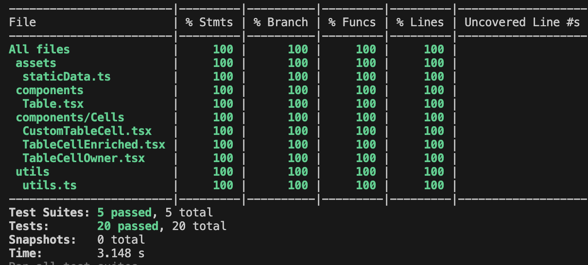

# Getting Started

This project uses [Vite](https://vitejs.dev/)

```bash
npm install
npm run dev
```

# Testing

This repo uses [Jest](https://jestjs.io/) for testing. The convention is to put each component's test file next to the component file.

```bash
npm test

# To rerun tests automatically as you make changes:
npm run test:watch

# To see % test coverage:
npm run test:coverage
```



# Code Quality

This repo is configured with husky to run `eslint` and `prettier` as pre-commit hooks.
You can also run them manually with:

```bash
# prettier
npm run format

# eslint
npm run lint
```

# Building for production

```bash
npm run build

# and optionally run a local server to preview:
npm run preview
```

The production build to serve can be found in the `/dist` folder
